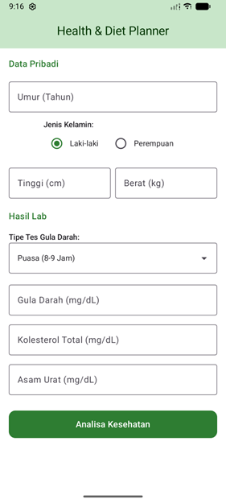
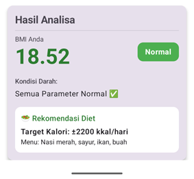
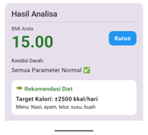
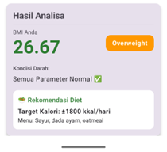
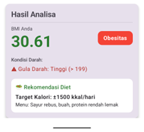
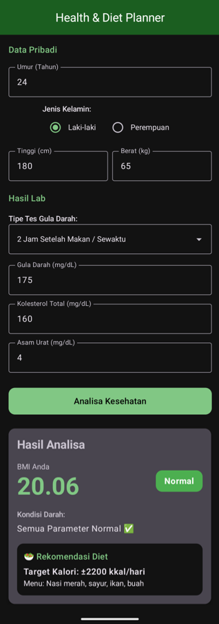

# 🩺 Health Calculator & Diet Planner


Aplikasi Android sederhana namun cerdas untuk menghitung **Body Mass Index (BMI)** dan menganalisis parameter kesehatan (**Gula Darah, Kolesterol, Asam Urat**) berdasarkan standar medis yang disesuaikan dengan umur dan jenis kelamin. Aplikasi ini memberikan rekomendasi diet yang dipersonalisasi.

Dibangun sepenuhnya menggunakan **Kotlin** dan **Jetpack Compose** dengan desain **Material 3**.

---

## 📱 Tampilan Aplikasi (Screenshots)

<table align="center">
  <tr>
    <th>Input Data</th>
    <th>Hasil Analisa</th>
    <th>Dark Mode</th>
  </tr>
  <tr>
    <td align="center">
      
    </td>
    <td align="center">
      <br>
      <br>
      <br>
      
    </td>
    <td align="center">
      
    </td>
  </tr>
</table>

---

## ✨ Fitur Utama

* **🧮 Kalkulator BMI Akurat:** Menghitung BMI dan mengategorikannya (Kurus, Normal, Overweight, Obesitas).
* **🩺 Analisa Kesehatan Dinamis:**
    * Validasi **Gula Darah** berdasarkan *Tipe Tes* (Puasa, Sebelum Makan, Setelah Makan) dan *Umur*.
    * Validasi **Asam Urat** berdasarkan *Gender* (Pria/Wanita) dan *Umur*.
    * Validasi **Kolesterol** berdasarkan *Umur* (Anak vs Dewasa).
* **🥗 Rekomendasi Diet:** Memberikan target kalori harian dan saran menu makanan berdasarkan hasil BMI.
* **🎨 Material Design 3:** Tampilan modern yang mendukung **Light Mode** dan **Dark Mode**.
* **📂 Clean Architecture:** Kode terstruktur rapi dengan pemisahan *UI*, *Logic*, dan *Data*.
* **📴 100% Offline:** Tidak memerlukan koneksi internet, login, atau database server.

---

## 🛠️ Teknologi yang Digunakan

| Komponen | Teknologi |
| :--- | :--- |
| **Bahasa** | [Kotlin](https://kotlinlang.org/) |
| **UI Framework** | [Jetpack Compose](https://developer.android.com/jetpack/compose) |
| **Design System** | [Material Design 3](https://m3.material.io/) |
| **IDE** | Android Studio |
| **JDK** | Java 17 / 11 |
| **Min SDK** | API 24 (Android 7.0) |

---

## 📂 Struktur Proyek

Proyek ini menggunakan struktur folder yang memisahkan *Logic* dan *UI* (Separation of Concerns):

```text
com.example.healthcalculator
├── MainActivity.kt           // Entry Point
├── model                     // Logika Bisnis & Data
│   ├── CalculationResult.kt  // Data Model Output
│   ├── HealthCalculator.kt   // Algoritma Perhitungan Medis
│   └── HealthEnums.kt        // Enum (Gender, AgeCategory, SugarType)
└── ui                        // Antarmuka Pengguna (Compose)
    ├── components            // Komponen Reusable (Input, Card)
    ├── screen                // Halaman Utama (HomeScreen)
    └── theme                 // Konfigurasi Tema & Warna
